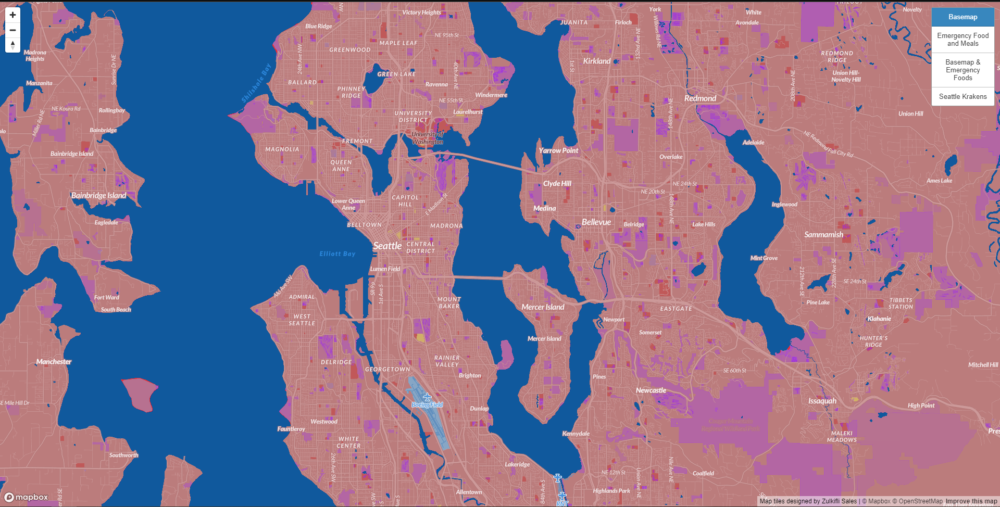
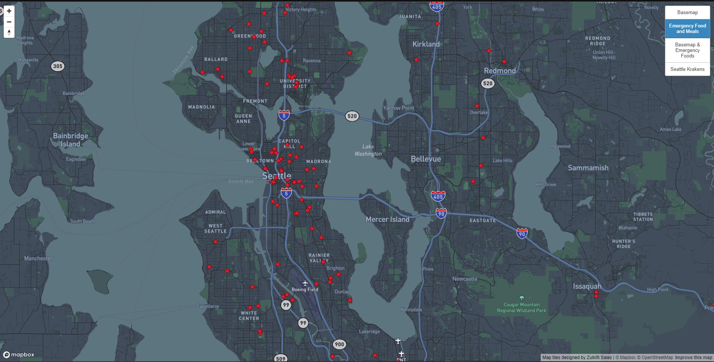
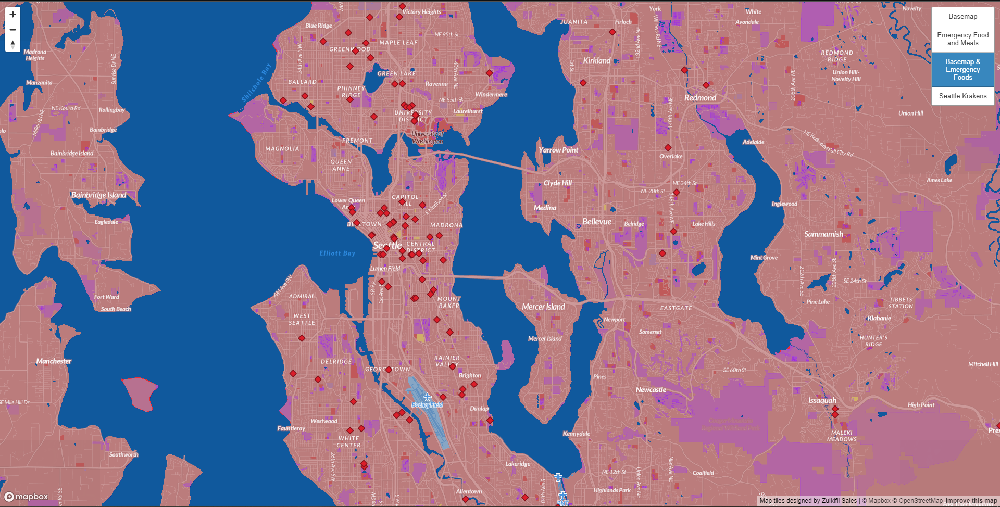
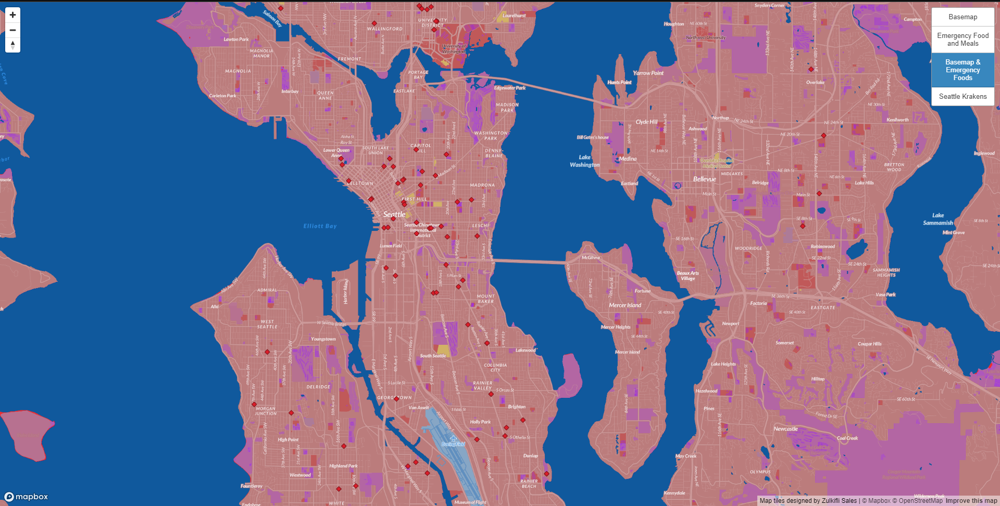
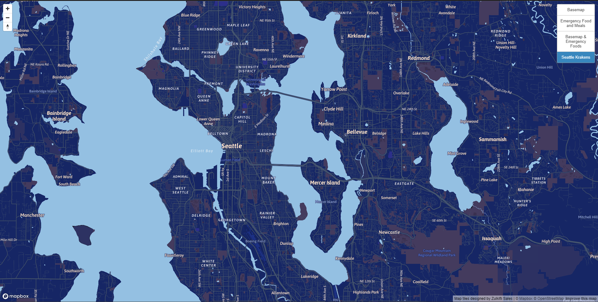

# Zulkifli Sales | GEOG 458 | Bo Zhao 
## Project Topic: Map Design and Tile Generation | Seattle Emergency Food and Meals in King County

[Here is the link to access the webpage with the different map tiles for this project!](https://notzulkifli.github.io/map_design_tile_set/)

Geographic Area and Projection for All layers: EPSG:3857 "Pseudo-Mercator"

### First Tile: Basemap

For the basemap above, I had customized the colors of the monochrome base layer. **Airports** are colored *sky blue*, The **base** is a nice *pink*, **greenspace** was colored *periwinkle purple* to compliment the pink base color, **Hospitals** are colored *yellow*, **schools** are colored *red* and the **water** is colored *dark blue*. I had also changed the font to make it more appealing and chose **Lato** and used the variations of that font for various aspects of the map design. We are focusing on the Seattle area, to be more specific, the king county area. The **Maximum Zoom level** I chose was **13** because 13 allows for clear zoom in on street names and higher quality map navigation. This Base map’s purpose is to create a visually appealing base layer for thematic layer that will come next.

### Second Tile: Emergency Food and Meals (Thematic Layer)

The customization for this map was limited. I mainly chose the **Navigation map layer** so that we can easily see where **Emergency food and meals locations such as food banks can be found.** Navigation allows for easier viewing of streets which is why I chose it to represent the thematic layer. The dataset used is focusing on **King County area**, so the points are around the city of Seattle and span out a bit more to the borders of the county. Each data point is represented by a *red diamond shape*. The **maximum zoom** I chose for this layer was **12** and this is because, the navigation layer is already incredibly detailed, so having the zoom layer at 12 will be sufficient for viewing and analyzing.
thematic layer (max zoom 12)

### Third Tile: Basemap + Seattle Emergency Food and Meals (King County)

Just like with the basemap, I utilized the colors of the points to fit the theme of basemap. This layer is displaying the basemap from the first tile and the thematic layer from the second tile. Here we can see that from *Seattle, here are the locations for emergency food and meals in the King County area.* 

The image above shows a zoomed in version of the third tile. I also screenshotted this because I wanted to display how spread out the points are in the Seattle area and the street names appear more. This is important because for my **maximum zoom, I chose 14**. I chose 14 because the points and base map are valuable information and being able to clearly view each point and the location associated with the location is important for analysis.

### Seattle Krakens

The Seattle Krakens are something I am interested in currently because they are a new team to Washington! I designed the map and color coded the display to match their theme. This also relates to my research interest because when you search "cyberattack" on google images, the overlying theme is the color of blue or green for code. I went with the blue theme because it is more visually appealing.
I had customized the layer so that the **base** is a *dark blue*. The **greenspace** is mix of *brown and purple*. The **place labels and road labels, and transit** are similar *beige* colors because they all relate in certain aspects. The **roads** are a *greyish toned* color and finally the **water** is a *sky blue.* As for the font, I chose to use the Asap font on mapbox and use the different variations accordingly. The **maximum zoom** I chose for the Seattle Krakens tile is **13**. Similar to the basemap, the ability to zoom and have high quality information available is the reason I chose 13 as the max zoom level.

#### Credit
[Emergency Food and Meals Seattle and King County](https://data.seattle.gov/Community/Emergency-Food-and-Meals-Seattle-and-King-County/kkzf-ntnu)

